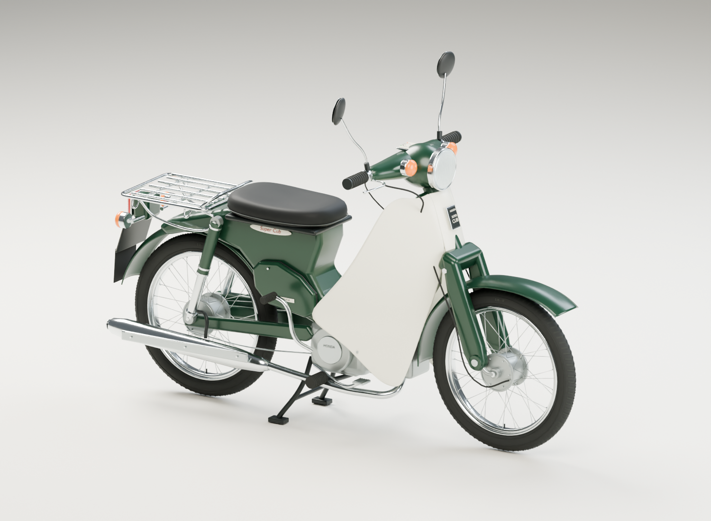

# Super CUB

Blenderで制作した、丸目・深緑 × アイボリーのスーパーカブを表示するXRiftアイテムです。
Honda公式写真などを参考に、1999〜2002年ごろのスーパーカブ50・スタンダード（AA01系）の外観をモデリングしています。



## 乗り方

`Vehicle` + 運転席`Seat` + 荷台の同乗席`Seat`の構成で、XRift上で2人乗りできます。

- シートを狙って「バイクに乗る」で着席。WASD・スティックで操縦、Spaceで降車
- 荷台を狙って「荷台に乗る」でもう一人が同乗。Vehicleごと動くため同期は不要
- 最高速は約15 m/s。`src/drive.ts`の`SUPER_CUB_TUNE`で調整
- N・1〜4速のロータリー式マニュアルギア：Nから発進し、Wのダブルタップでシフトアップ、Sのダブルタップでシフトダウン。
  1速からのダウンでN、停止中の4速からのアップでNに戻る(実車のロータリー式)。
  S単発・長押しはブレーキ専用(ギアは変わらない。実車同様バックは無し)。
  Nでは駆動が切れ、Wは空ぶかし(音だけ・前進なし)、Sで足漕ぎのよちよち後退だけできる
  (壁に詰まった時の脱出用)。N時の速度表示は0のまま。
  Shiftキーでもシフトアップ可(キーイベントが届く環境のみ)。
  駆動・エンジンブレーキは実車諸元ベースのフォースモデル
  (変速比3.181/1.705/1.190/0.916・1次4.058・2次3.538、5.1N·m、車重80kg+乗員65kg：
  4速発進はもっさり、4速のアクセルオフは惰行気味になる)。
  自動変速は入らない(`src/drive.ts`の`SUPER_CUB_TUNE.autoShift`を`true`に戻すと自動変速あり)。
  運転中は実メーター上の3D表示にギア・速度・ギア比が出る(VRでも見える3Dジオメトリのみ使用)
- 走行処理(`driveSuperCub`)は運転者のクライアントでのみ動き、姿勢は`Vehicle`が同期
- 地形追従あり：Rapierへのレイで車高・ピッチ・ロールを合わせ、凸凹や坂に沿って走る。旋回時は曲がる方向へリーンする(ヨーレート×速度、最大約20°)。登坂では速度が落ち、前方の壁は通り抜けずに止まる(登れる坂は止めない)。地面データが無い場所では高度を保持し、すり抜け落下しない
- エンジン音付き：WebAudioで合成した排気音が回転数に連動(音源ファイル不要・VRでも再生)。
  運転者に聞こえ、他人の運転中は距離減衰して聞こえる。駐車中は無音
- 前後輪の回転・ハンドル/フロントフォークの操舵・スタンドの格納は見た目の追従で、全クライアントに反映
- ヘッドライトのスポットライト付き。降車位置はマフラーと逆の左側

## モデル

| ファイル | 用途 |
| --- | --- |
| `blender/super-cub.blend` | 部品・材質・モディファイアを編集できるBlenderファイル |
| `src/assets/super-cub.glb` | XRiftで読み込むモデル |
| `blender/super_cub.py` | モデリングを再生成するBlender Pythonスクリプト |
| `blender/export.py` | `.blend`の保存・GLBの書き出し |
| `blender/model-stats.json` | メッシュ数・三角形数・実寸などの書き出し情報 |
| `blender/references/README.md` | 参考写真の出典と造形の基準 |

外装、スポークホイール、ボトムリンク式の前足、リアサスペンション、横型エンジン、マフラー、シート、リアキャリア、メーター、ミラー、灯火類を部品単位で構成しています。

- 実寸スケール：全長約1.78 m、ホイールベース1.175 m。
- GLB：Y-up、前方+Z、接地面Y=0。外部テクスチャ不要。
- GLBは材質×部位で結合した51メッシュ(前輪・後輪・操舵系・スタンドを可動ノードとして分離)。詳細な編集用部品は`.blend`に保持。
- Blenderの`Super Cub — Studio`シーンにモデルと撮影用カメラ・照明を配置。
- 参考写真は`.blend`にパック済み。画像エディターから`cub-aa01-1999.jpg`、`cub-aa01-green.jpg`を開けます。

### Blenderで編集・再生成

`blender/super-cub.blend`を開くと、部品別のコレクションから編集できます。
撮影カメラは`SC_Camera_Hero`、`SC_Camera_RightSide`、`SC_Camera_Rear`、`SC_Camera_Front`です。

再生成する場合は、Blenderのテキストエディターで`super_cub.py`を実行し、その後`export.py`を実行します。
Blender Lab MCPの`execute_blender_code`からも実行でき、今回の制作には起動中のBlenderへのMCP接続を使用しています。

`export.py`はGLB用の一時コピーを評価・結合して書き出します。
Blenderのカメラから再レンダリングした画像は、`blender/super-cub-preview.png`および`public/thumbnail.png`に保存するとプレビューを更新できます。

## セットアップ

```bash
npm install
npm run dev
```

ドラッグで視点回転、ホイールでズーム。WASD/矢印キーで試走できます(開発用の挙動確認。本番の着席・同期はXRift上で行われます)。

開発時は `DevEnvironment`(単独プレイヤー用の座席システム入り)で本番と同じ経路を通します。
画面クリックでポインターロック→シートを狙ってクリックで着席→WASD操縦・Space降車。
Tキーでも運転席に着席できます。`?orbit=1` では orbit 表示＋WASD試走リグになります。

## ビルド

```bash
npm run build
```

GLBはViteによって`dist`に出力され、Module Federationの配信元を基準とした相対URLで読み込まれます。

## Shared 依存関係

このテンプレートは [Module Federation](https://module-federation.io/) を使用しており、以下の依存関係はホストアプリケーション（xrift-frontend）と共有されます。アイテムのバンドルにはインライン化されず、shared チャンクとして分離されます。

| パッケージ | バージョン |
| --- | --- |
| `react` | ^19.0.0 |
| `react-dom` | ^19.0.0 |
| `react/jsx-runtime` | - |
| `three` | ^0.183.1 |
| `three/addons` | ^0.183.1 |
| `@react-three/fiber` | ^9.3.0 |
| `@react-three/rapier` | ^2.1.0 |
| `@react-three/drei` | ^10.7.3 |
| `@react-three/uikit` | ^1.0.0 |
| `@pmndrs/uikit` | ^1.0.0 |
| `@xrift/world-components` | ^0.53.0 |

### `three/addons` について

`three/addons` は shared 依存として利用可能です。`DRACOLoader` や `GLTFLoader` など Three.js のアドオンモジュールを使用する場合は、`three/addons/*` からインポートしてください。

```tsx
// OK: shared チャンクとして分離される
import { DRACOLoader } from 'three/addons/loaders/DRACOLoader.js'
import { GLTFLoader } from 'three/addons/loaders/GLTFLoader.js'
```

これにより、アドオンモジュールがアイテムチャンクにインライン化されることを防ぎます。インライン化された場合、`@xrift/code-security` によって `new Worker()` などが critical 違反として検出される問題が発生します。
